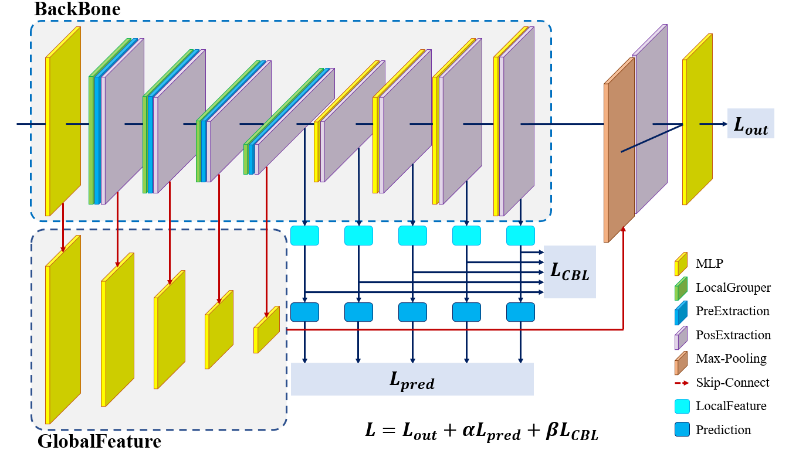

## Framework




## Environment

Our network is tested in the following environments:

* CUDA 10.0
* cuDNN 7.6.5

And then you need to switch to the current directory in the terminal and execute the following command to install the environment dependency:

```bash
# please remember to switch to the current directory
pip install -r requirements.txt
```


## Data

Create a new folder in the current directory and name it `data` , then download `indoor3d_sem_seg_hdf5_data`  [here](https://shapenet.cs.stanford.edu/media/indoor3d_sem_seg_hdf5_data.zip) and unzip it and place it under `data` , the file structure is as follows:

```
root
 ├─ data.py
 ├─ main.py
 ├─ model.py
 ├─ loss.py
 ├─ metrics.py
 ├─ utils.py
 ├─ requirements.txt
 ├─ README.md
 ├─ data
 │   └─ indoor3d_sem_seg_hdf5_data
 │       ├─ all_files.txt
 │       ├─ ply_data_all_i.h5 (i = 0, 1, ... , 23)
 │       └─ room_filelist.txt
 └─ image
     └─ framework.png
```


## Train

Switch to the current directory on the terminal and execute `main.py` , and you can add the configuration items you want to add later

```bash
# please remember to switch to the current directory
python main.py
```

The configuration items are shown in the following table:

| configuration items | meaning                                        | type    |
| ------------------- | ---------------------------------------------- | ------- |
| `--save_dir`        | path to save the trained model                 | `str`   |
| `--data_path`       | dataset path, default `data`                   | `str`   |
| `--batch_size`      | batch size in batch processing                 | `int`   |
| `--num_points`      | number of samples per training, default `4096` | `int`   |
| `--test_area`       | test area, default `5`                         | `int`   |
| `--threads`         | number of threads during training              | `int`   |
| `--pretrain`        | whether to load the pre-trained model          | `bool`  |
| `--optimizer`       | optimiser for iterations during model training | `str`   |
| `--lr`              | learning rate, default `0.0001`                | `float` |
| `--epochs`          | training rounds                                | `int`   |
| `--model`           | model name                                     | `str`   |
| `--num_classes`     | number of semantic categories, default `13`    | `int`   |
| `--transform`       | whether data augmentation is needed            | `bool`  |
| `--gpu_id`          | which GPU you need to use                      | `int`   |
| `--in_channel`      | channel for input data                         | `int`   |
| `--eval`            | whether need to validate during training       | `bool`  |
| `--test`            | to test or not to test(train)                  | `bool`  |


## Test

